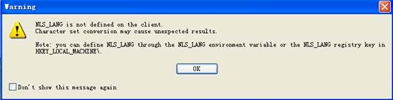

## 	免安装Oralce使用PL/SQL连接数据库

1. 到oracle官网下载InstantClient，[下载地址]([http://www.oracle.com/technetwork/database/features/instant-client/index-097480.html](http://www.oracle.com/technetwork/database/features/instant-client/index-097480.html))

2. 把下载的压缩包解压至任一目录，如D:\oralce\  。
3. 打开PL/SQL --> Tool -->Prefrences, 找到Connection，设置Oracle Home， OCI Library 的路径分别为：  D:\oracle\instantclient\_10\_2  和 D:\oracle\instantclient\_10\_2\oci.dll。
4. 设置环境变量：

		NLS_LANG = SIMPLIFIED CHINESE_CHINA.ZHS16GBK

		TNS_ADMIN = D:\instantclient_10_2\

		Path = D:\instantclient_10_2\;%Path%
5. 把tnsnames.ora文件拷贝到D:\oracle\instantclient\_10\_2下。 

6. 现在你的PL/SQL可以连接数据库了。

**注：**  
> 如果不设置NLS_LANG环境变量，访问数据库有可能乱码，登录PL/SQL会弹出如下警告：

> 如果不设置TNS_ADMIN环境变量，会报如下错误：
